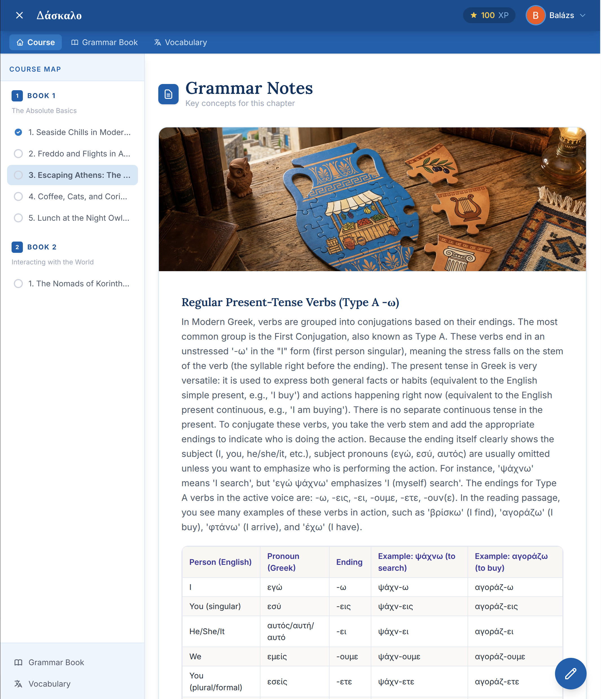
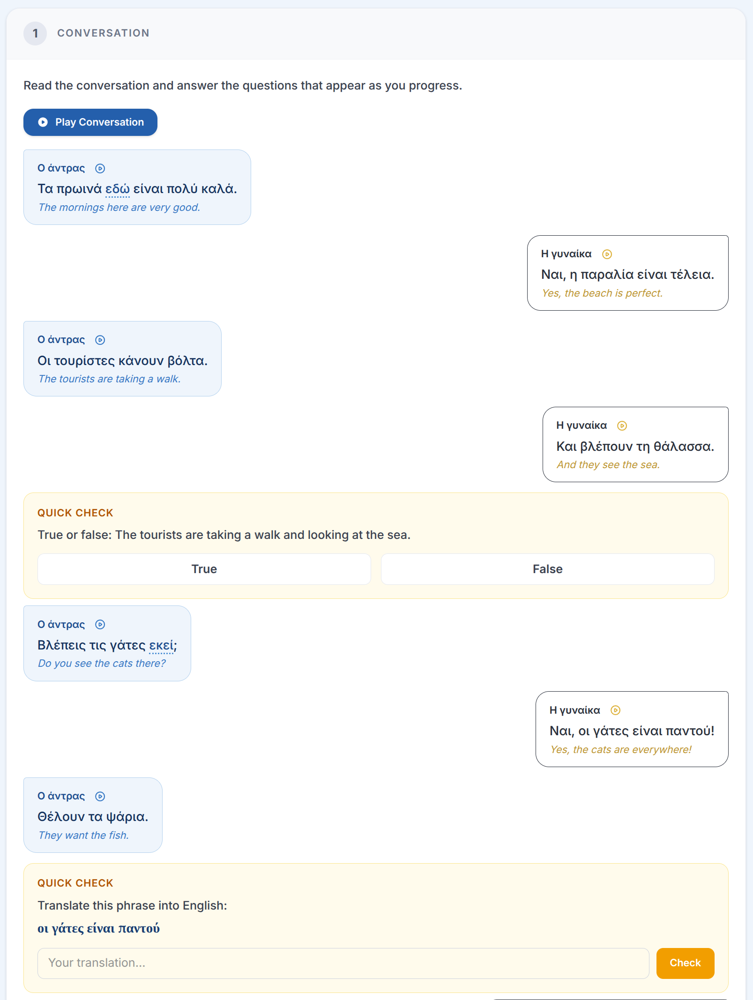

<div align="center">
  
  
  # Daskalo
  
  **An AI-powered, interest-driven Greek language learning platform.**

  
</div>

---

Learning a new language requires consistency and a solid pedagogical structure, but staying motivated requires engaging content. **Daskalo** (Greek for "Teacher") bridges this gap. 

Rather than forcing students through static, one-size-fits-all lessons about booking a hotel room or ordering an apple, Daskalo uses generative AI to build personalized lessons around the student's actual interests—whether that's ancient history, software engineering, or Mediterranean cooking. 

Behind the scenes, this dynamic content generation is governed by a strict, scientifically designed curriculum. As the student progresses, the AI weaves specific vocabulary baselines and grammatical milestones into the custom topics, ensuring real language acquisition and structured progression.

### 📖 Lesson Structure & Exercises

Every generated chapter serves as a comprehensive lesson, combining context-aware grammar notes, targeted vocabulary, and a series of interactive exercises that test different cognitive language skills.

Currently, Daskalo evaluates students through four core exercise types:
*   **🖼️ Image Description:** Students are presented with an image and must describe it in Greek, testing free-form vocabulary and sentence construction.
*   **🗣️ Pronunciation Practice:** Students record themselves speaking Greek phrases, receiving instant, phonetic AI feedback on their accent and clarity.
*   **📝 Translation Challenge:** Context-driven translation exercises between Greek and the student's native language.
*   **🎧 Dictation:** Students listen to native-sounding text-to-speech audio and must accurately transcribe what they hear.

---

## 🛠️ Tech Stack

Daskalo is built as a modern, cloud-native monorepo:

**Frontend**
*   **Angular** (Standalone Components, Signals for state management)
*   **TailwindCSS** for responsive styling
*   **Firebase Web SDK** (v10+ modular)

**Backend & Infrastructure**
*   **Python 3.11+** via FastAPI & Google Cloud Functions (2nd Gen)
*   **Firestore** (using a named database: `daskalo-db`) & Firebase Storage
*   **Terraform** for Infrastructure as Code

**Content Pipeline (CLI Engine)**
*   **LangGraph / LangChain** for orchestrating complex lesson generation workflows
*   **Google Cloud Vertex AI** (Gemini 2.5-flash / 3.1) for evaluation and content creation
*   **Google Cloud TTS & Piper** for voice generation

---

## 💻 Local Development

Daskalo is heavily optimized for local development without the need to hit production databases or incur cloud costs. It relies on the **Firebase Local Emulator Suite** (Auth, Firestore, Storage) to provide a safe sandbox.

The easiest way to start the entire stack (Frontend, Backend, and Emulators) is using the included development script:

```bash
./dev.sh
```

This will start the emulators, the FastAPI backend (with hot-reload), and the Angular frontend.

## 🚀 Deployment

Deployment to Google Cloud and Firebase is orchestrated by a central script that handles building the Python archives, applying Terraform infrastructure, compiling the Angular application, and deploying the Firebase rules and hosting.

```bash
./deploy.sh            # Full deployment (infrastructure + frontend)
./deploy.sh --infra    # Apply Terraform and deploy Cloud Functions only
./deploy.sh --hosting  # Build Angular and deploy to Firebase Hosting only
```

---

## 📚 Documentation

For deeper technical details on how the system is structured, please refer to the following guides:

*   [**Architecture Overview**](docs/ARCHITECTURE.md) - System design, event-driven flows, and component interactions.
*   [**Data Model**](docs/DATA_MODEL.md) - Firestore schema and document definitions.
*   [**AI Agent Rules**](AGENTS.md) - Context and style guides for working with AI coding assistants in this repository.

---

## ⚖️ License

**MIT License**

Copyright (c) 2026 The Daskalo Authors

Permission is hereby granted, free of charge, to any person obtaining a copy
of this software and associated documentation files (the "Software"), to deal
in the Software without restriction, including without limitation the rights
to use, copy, modify, merge, publish, distribute, sublicense, and/or sell
copies of the Software, and to permit persons to whom the Software is
furnished to do so, subject to the following conditions:

The above copyright notice and this permission notice shall be included in all
copies or substantial portions of the Software.

THE SOFTWARE IS PROVIDED "AS IS", WITHOUT WARRANTY OF ANY KIND, EXPRESS OR
IMPLIED, INCLUDING BUT NOT LIMITED TO THE WARRANTIES OF MERCHANTABILITY,
FITNESS FOR A PARTICULAR PURPOSE AND NONINFRINGEMENT. IN NO EVENT SHALL THE
AUTHORS OR COPYRIGHT HOLDERS BE LIABLE FOR ANY CLAIM, DAMAGES OR OTHER
LIABILITY, WHETHER IN AN ACTION OF CONTRACT, TORT OR OTHERWISE, ARISING FROM,
OUT OF OR IN CONNECTION WITH THE SOFTWARE OR THE USE OR OTHER DEALINGS IN THE
SOFTWARE.
